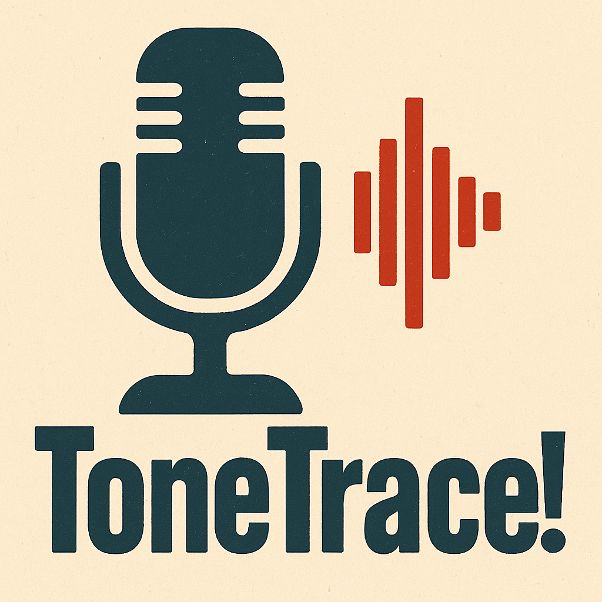

<h1 align="center"> 🔊 Tone Trace 🐾 </h1>

**Tone Trace** es una herramienta de procesamiento de señales que clasifica voces humanas (masculinas/femeninas) y sonidos de animales (gatos/perros) utilizando técnicas de **series de Fourier** y **transformada de Laplace**.

---

## 🚀 Características
- 🔊 Grabación y reproducción de audio
- 📊 Análisis de espectro de frecuencia con FFT
- 🔍 Comparación y reconocimiento de sonidos similares
- 📈 Visualización del espectro de frecuencia
- 🧠 Diseñado para modelos ligeros o experimentación
- 🐶 Soporta tanto voces humanas como sonidos de mascotas

---

## 🧠 ¿Qué puedes hacer con Tone Trace?
- Grabar sonidos y analizar su espectro de frecuencia
- Cargar archivos de audio existentes
- Identificar sonidos similares en tu biblioteca de audio
- Visualizar el espectro de frecuencia de cualquier audio
- Usar como herramienta educativa para explorar el procesamiento de señales con datos de audio reales

<h1 align="center">  🔧 Comenzando </h1>

Sigue estos pasos para configurar el entorno de desarrollo para **Tone Trace**:

**Paso 1:** Clona el repositorio 

**Paso 2:** Crea un entorno virtual: 

    python -m venv venv

**Paso 3:** Activa el entorno virtual: 

    .\venv\Scripts\activate

**Paso 4:** Instala las dependencias requeridas: 

    pip install -r requirements.txt

Si instalas o eliminas alguna biblioteca, recuerda actualizar el archivo de requisitos:
    
    pip freeze > requirements.txt

<h1 align="center">  📊 Uso </h1>

1. **Grabar Audio**: Haz clic en el botón "🎤 Grabar Sonido" para grabar 5 segundos de audio.
2. **Cargar Audio**: Haz clic en "📂 Cargar Archivo de Audio" para seleccionar un archivo WAV o MP3 existente.
3. **Reproducir Audio**: Haz clic en "▶️ Reproducir Último Sonido" para escuchar el último audio grabado o cargado.
4. **Analizar Audio**: Haz clic en "🔍 Analizar Audio" para:
   - Visualizar el espectro de frecuencia del audio
   - Encontrar audios similares en tu biblioteca
   - Ver la similitud entre los audios encontrados

<h1 align="center">  🧮 Base Matemática </h1>

Tone Trace utiliza la **Transformada Rápida de Fourier (FFT)** para analizar los sonidos. La FFT es un algoritmo eficiente para calcular la transformada discreta de Fourier (DFT) y su inversa.

La transformada de Fourier descompone una señal en sus componentes de frecuencia, lo que permite:

1. **Análisis de Frecuencia**: Identificar las frecuencias dominantes en un sonido
2. **Comparación de Sonidos**: Medir la similitud entre diferentes sonidos
3. **Reconocimiento de Patrones**: Identificar patrones característicos en los sonidos

La implementación utiliza:
- Ventana de Hann para reducir el efecto de los bordes
- Normalización del espectro para comparaciones consistentes
- Detección de picos para identificar frecuencias características
- Similitud del coseno para comparar espectros de frecuencia

<h1 align="center">  📝 Licencia </h1>

Este proyecto está licenciado bajo la Licencia MIT - ver el archivo LICENSE para más detalles.
